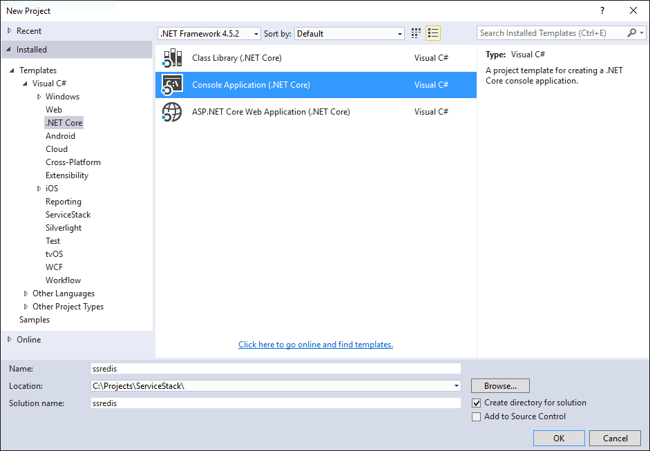
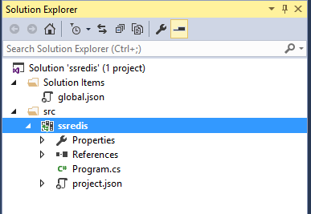
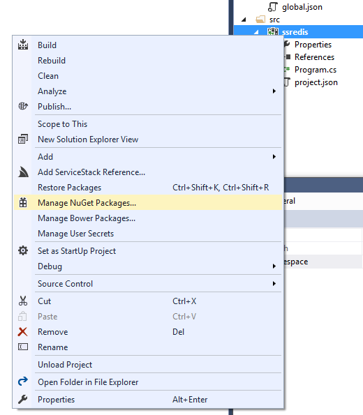
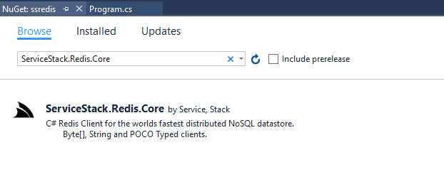
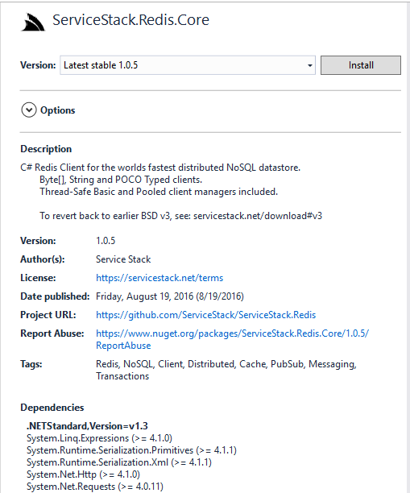
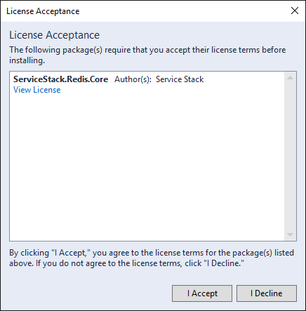
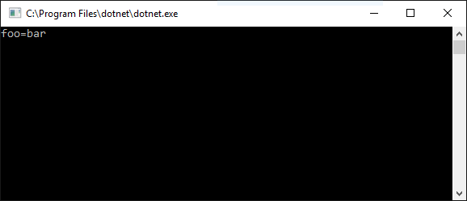
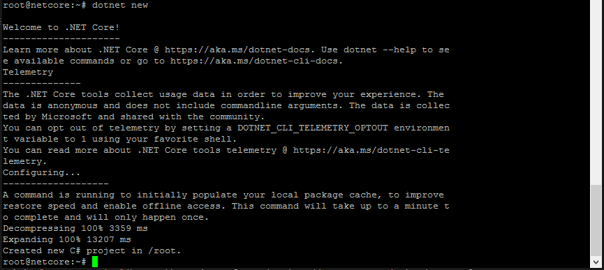
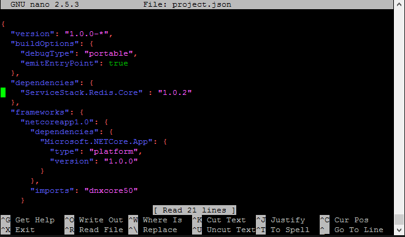
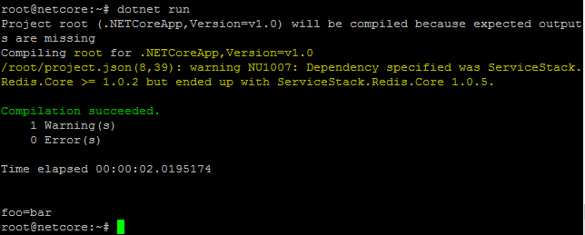

# Using ServiceStack.Redis on .NET Core

This guide shows how to create and execute .NET Core console application which
uses ServiceStack.Redis 

### Install .NET Core                                                                                                                                                           

At the first step you need to install [Visual Studio 2015 update 3](https://go.microsoft.com/fwlink/?LinkId=691129)  and [.NET Core 1.0.0 - VS 2015 Tooling Preview](https://go.microsoft.com/fwlink/?LinkId=817245).

To get more details about Visual Studio 2015 update 3 and .NET Core installation 
you can visit [.NET Core](https://www.microsoft.com/net/core#windows) site

### Create .NET Core Application

In Visual Studio click `File-> New-> Project` and select **.NET Core/Console Application (.NET Core)** 
from VS templates.



You will get following structure in Solution Explorer.



Right click on the project and select **Manage NuGet Packages**



In opened window click **Browse** tab, type `ServiceStack.Redis.Core` and hit **Enter**



Select package and click **Install** button on the right pane



Visual Studio asks to read and accept licence, click **Accept** button



Then open file `Program.cs` and write the code. Change the address `localhost:6379` to the
host:port where your Redis server is located.

```csharp
using System;
using ServiceStack.Redis;

namespace ssredis
{
    public class Program
    {
        public static void Main(string[] args)
        {
            var manager = new RedisManagerPool("localhost:6379");
            using (var client = manager.GetClient())
            {
                client.Set("foo", "bar");
                Console.WriteLine("foo={0}", client.Get<string>("foo"));
            }
        }
    }
}
```

Then hit "run" button **(F5)**. You should get following output:



## Run ServiceStack.Client on Linux

### Install .NET Core

Suppose that you have ubuntu 16.04 installed (to see installation instructions for other OS you can 
visit [.NET Core site](https://www.microsoft.com/net/core)). Run commands in the console:

    sudo sh -c 'echo "deb [arch=amd64] https://apt-mo.trafficmanager.net/repos/dotnet-release/ xenial main" > /etc/apt/sources.list.d/dotnetdev.list'
    sudo apt-key adv --keyserver apt-mo.trafficmanager.net --recv-keys 417A0893
    sudo apt-get update
    sudo apt-get install curl dotnet-dev-1.0.0-preview2-003121

### Create Project

    dotnet new

This command will create `project.json` and `Program.cs` files in current folder.



Open `project.json` for edit:

    nano project.json

and edit empty `dependencies: {}` section to add `ServiceStack.Redis.Core` reference:
    
    dependencies: {
        "ServiceStack.Redis.Core" : "1.0.2"
    }



type `Ctrl+X` to exit. Answer 'yes' to save changes in the file.

then open and edit `Program.cs` file. Type `nano Program.cs` and copy the code
(change `localhost:6379` to `host:port` where your Redis Server is located.

```csharp
using System;
using ServiceStack.Redis;

namespace ssredis
{
    public class Program
    {
        public static void Main(string[] args)
        {
            var manager = new RedisManagerPool("localhost:6379");
            using (var client = manager.GetClient())
            {
                client.Set("foo", "bar");
                Console.WriteLine("foo={0}", client.Get<string>("foo"));
            }
        }
    }
}
```
### Run the Project

In console type:

    dotnet restore
    dotnet run

The first command restores packages (note that packages version may vary from the version on screenshot) and second compiles and runs the application
 and outputs value of `foo` key to console.




## Limitations

`ServiceStack.Redis.Core` is implemented to support [.NETStandard 1.3](https://github.com/dotnet/corefx/blob/master/Documentation/architecture/net-platform-standard.md) interface.
Due to .NET Core does not support `BinaryFormatter` and `Remoting`, `ServiceStack.Redis.Core` does not support classes in `ServiceStack.Redis.Support` namespace

 - RedisChronologicalWorkQueue
 - RedisSequentionalWorkQueue
 - RedisSimpleWorkQueue
 - SerializingRedisClient
 - ObjectSerializer
 - OptimizedObjectSerializer
 - Locking.DistributedLock
 - Diagnostic.TrackingRedisClientProxy
 - Diagnostic.TrackingRedisClientManager
